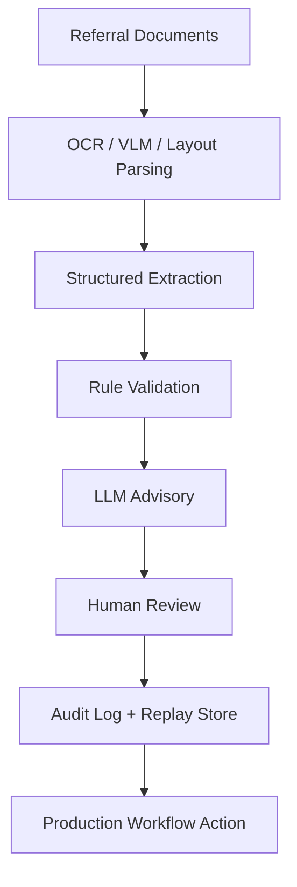

> Draft architecture writeup. Abstracted and sanitized — no patient data, production
> endpoints, or internal system details.

## Overview

The intake workflow is deliberately staged. Each step produces structured output plus
provenance, so the next step — and ultimately a human reviewer — can inspect and trust it.
The model **advises**; deterministic rules and a human make the decisions; everything is
logged so a case can be replayed.

## Flow

## Stage notes

- **Referral Documents** — mixed-quality faxes, scanned PDFs, and images arrive as input.
- **OCR / VLM / Layout Parsing** — recover text *and* layout; structure carries meaning.
- **Structured Extraction** — pull target fields into a typed schema.
- **Rule Validation** — deterministic checks for format, required fields, and consistency,
  run before anything reaches a person.
- **LLM Advisory** — annotate low-confidence fields and flag likely issues. Advisory only.
- **Human Review** — a reviewer confirms, corrects, or rejects, with the source region shown
  alongside each suggestion.
- **Audit Log + Replay Store** — inputs, model outputs, rule results, and human actions are
  recorded so a case can be reconstructed and re-run.
- **Production Workflow Action** — only reviewed, confirmed data flows downstream.

## Design principles

- **Advisory, not autonomous** — the model never writes final values directly.
- **Provenance is first-class** — every value knows where it came from.
- **Replayable by design** — persisted state makes incidents debuggable and enables
  re-evaluation against new model versions.
- **Deterministic gates around model steps** — rules catch what code can catch; humans catch
  what judgment requires.
