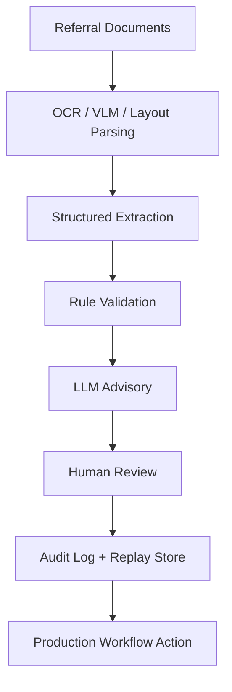

## Overview

This is a **sanitized project case study** based on an AI-assisted healthcare referral
intake workflow. It describes how document-heavy intake can be automated without handing
final judgment to a model: deterministic rules produce the preliminary decision, an LLM
contributes evidence-bound advisory output, and a human reviewer holds final authority. Every
meaningful step is recorded in an audit trail and can be replayed for regression evaluation
before any policy or prompt change is promoted.

The focus throughout is **reliability, auditability, human review, and safe integration into
a production workflow** — the properties that decide whether an AI-assisted system can
actually be used in a setting where a wrong answer has real consequences.

A public, frontend-only interactive demo accompanies this writeup. It illustrates the
governance model with synthetic data and does not process real information.

> **Live Demo:** [auditable-ai-referral-demo.vercel.app](https://auditable-ai-referral-demo.vercel.app/)

## Problem

Referral intake is document-heavy. Incoming requests arrive as mixed-quality documents that
have to be checked against eligibility, payer, authorization, and evidence requirements before
the case can move forward.

- Manual review is slow and inconsistent across reviewers.
- Critical fields are frequently missing, ambiguous, or spread across several documents.
- AI output cannot be blindly trusted in a healthcare-like workflow — a confident but wrong
  extraction or decision is worse than no automation at all.
- The system therefore needs **human validation, full traceability, and a safe fallback** for
  cases that are uncertain, incomplete, or high-risk.

## System Design

The workflow is a staged pipeline. Each stage produces structured output plus provenance, so
the next stage — and ultimately a human reviewer — can inspect and trust it.

- **Referral documents** — the raw, unstructured input.
- **OCR / VLM / layout parsing** — recover text *and* layout; structure carries meaning.
- **Structured extraction** — pull target fields into a typed schema.
- **Rule-first validation** — deterministic checks produce the preliminary decision and the
  routing reason before anything reaches a person.
- **LLM advisory layer** — evidence-bound observations and flags that support review. Advisory
  only; the model cannot write the final decision.
- **Human review** — a reviewer confirms or overrides, with the supporting evidence shown
  alongside each suggestion.
- **Audit logging** — every input, model output, rule result, and human action is recorded
  with explicit causation.
- **Replay / regression evaluation** — policy and prompt versions are compared against
  historical cases to surface deltas and potential regressions before promotion.
- **Workflow action after confirmation** — only reviewed, confirmed data flows downstream.

This design deliberately separates three decisions that are easy to conflate: the **rule
decision** (deterministic), the **routing decision** (does this need human review?), and the
**final decision** (the human's confirm or override).

For a standalone view of this architecture, see the
[AI-Assisted Intake Workflow Architecture](/architecture/ai-assisted-intake-workflow-architecture)
writeup.

## My Role

I worked on building and reasoning about:

- **AI-assisted workflow automation** — the staged pipeline and the decision boundaries
  between rules, model, and human.
- **Backend / data pipeline design** — structured, typed data flowing through each stage with
  provenance preserved.
- **Human-in-the-loop review flow** — the confirm/override interaction and the point at which
  a case is escalated to a person.
- **Structured extraction and validation** — schema-constrained outputs and rule-first checks.
- **Evaluation and reliability controls** — the audit trail and replay-based regression
  evaluation.
- **Production-safe AI behavior** — keeping the model advisory, evidence-bound, and unable to
  act unilaterally.

## Key Engineering Decisions

- **Rule-first validation, not fully autonomous LLM decisions.** Deterministic rules produce
  the preliminary decision. This keeps behavior predictable and independent of model variance.
- **LLM as an advisory layer, not final authority.** Model output is evidence-bound and cannot
  set the final decision; it exists to support a human, not replace one.
- **Human review for uncertain, incomplete, or high-risk cases.** Routing sends exactly the
  cases that need judgment to a person, rather than gating everything or nothing.
- **Schema-constrained outputs.** Extraction and advisory output are bound to a typed schema
  and to referenced evidence, which makes validation and downstream integration straightforward.
- **Audit logs and replayability.** Persisting inputs and intermediate outputs makes incidents
  debuggable and lets a case be re-run against a new policy or prompt version.
- **Sanitized, demo-only presentation for public portfolio use.** The public artifact is a
  frontend-only illustration with synthetic data — no production internals are exposed.

## Tradeoffs

- **Reliability over full automation.** Keeping a human in the loop caps throughput gains — an
  intentional choice where a wrong action carries real cost.
- **Traceability over hidden model behavior.** Full audit logging adds storage and complexity,
  justified by the need to reconstruct and review any decision.
- **Human validation over unchecked speed.** Requiring confirmation on consequential cases adds
  a step in exchange for correctness and trust.
- **A static portfolio demo over exposing production internals.** The public demo trades
  fidelity for safety: it demonstrates the governance model without revealing implementation
  detail or handling real data.

## Live Demo

The interactive demo walks through three synthetic intake scenarios — a low-risk auto-accept,
a missing-evidence case that requires review, and a rule-reject case that a human overrides —
plus a replay page that compares baseline and candidate policy/prompt versions.

**Live Demo:** [auditable-ai-referral-demo.vercel.app](https://auditable-ai-referral-demo.vercel.app/)

## Privacy / Sanitization Note

This public case study is **sanitized**. It does not include real patient data, PHI,
production endpoints, internal tickets, private credentials, or company-confidential
implementation details. The accompanying demo is a frontend-only mock: it uses only synthetic
data with whitelisted identifier formats, does not call real model APIs, and does not connect
to any production or clinical system.
